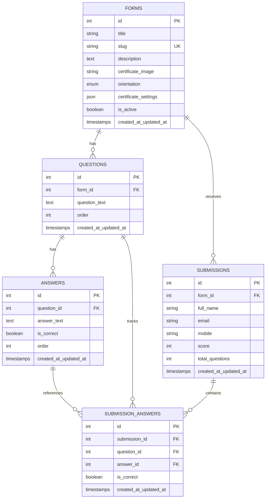

# 🎓 Laravel Student Certification System

<div align="center">


**A powerful, modern assessment platform with automated certificate generation**

[Features](#-features) • [Installation](#-installation) • [Usage](#-usage) • [Documentation](#-documentation) • [Contributing](#-contributing)

</div>

---

## 📋 Table of Contents

- [Overview](#-overview)
- [Features](#-features)
- [Technology Stack](#-technology-stack)
- [System Architecture](#-system-architecture)
- [Installation](#-installation)
- [Configuration](#-configuration)
- [Usage Guide](#-usage-guide)
- [API Routes](#-api-routes)
- [Database Schema](#-database-schema)
- [Certificate Designer](#-certificate-designer)
- [Deployment](#-deployment)
- [Testing](#-testing)
- [Troubleshooting](#-troubleshooting)
- [FAQ](#-faq)
- [Contributing](#-contributing)
- [License](#-license)

---

## 🌟 Overview

The **Laravel Student Certification System** is a comprehensive web application designed to revolutionize the way educational institutions, training organizations, and corporate entities conduct online assessments and issue digital certificates. Built on Laravel 11, this system combines robust backend architecture with a sleek, modern frontend to deliver an exceptional user experience.

### Why Choose This System?

- **Zero Configuration Database**: Uses SQLite out of the box - no complex database setup required
- **Visual Certificate Designer**: Drag-and-drop interface for pixel-perfect certificate customization
- **Mobile-First Design**: Fully responsive interface that works beautifully on all devices
- **Intelligent Typography**: Automatic text scaling and wrapping for long names
- **High-Resolution Output**: 3x DPI scaling ensures print-ready certificate quality
- **Sri Lankan Mobile Validation**: Built-in validation for local phone number formats
- **Secure Admin Portal**: Obscured login routes prevent unauthorized access attempts
- **Export Capabilities**: One-click CSV export of all submission data
- **Real-time Preview**: See exactly how certificates will look before publishing

---

## ✨ Features

### 🔐 Administrator Features

#### Form & Quiz Management

- **Unlimited Forms**: Create as many assessment forms as needed
- **Form Status Control**: Toggle between Active/Inactive states
- **Shareable Links**: Generate unique, SEO-friendly URLs for each form
- **Bulk Operations**: Manage multiple forms efficiently
- **Submission Tracking**: Real-time view of student responses
- **CSV Export**: Download all submission data for offline analysis

#### Visual Certificate Designer

The crown jewel of this system - a powerful, intuitive certificate customization tool:

- **Drag & Drop Positioning**: Click and drag the name element to any position on your certificate
- **Live Preview**: See changes in real-time as you design
- **Typography Controls**:
    - Font size (10px - 200px)
    - Font color (HEX color picker)
    - Font weight (Normal, Bold)
    - Font style (Normal, Italic)
- **Advanced Text Layout**:
    - **Max Width**: Define text boundary boxes
    - **Text Alignment**: Left, Center, or Right alignment
    - **Vertical Alignment**: Top, Middle, or Bottom positioning
    - **Max Lines**: Control text wrapping (1-5 lines)
    - **Auto-Scaling**: Intelligent font size reduction for long names
- **Background Options**:
    - Upload custom certificate templates
    - Support for both Horizontal (Landscape) and Vertical (Portrait) orientations
    - Fill, Cover, or Contain background modes
- **Test Mode**: Preview with sample names before publishing
- **Zoom Controls**: Zoom in/out for precise positioning

#### Question Management

- **MCQ Builder**: Create multiple-choice questions with ease
- **Dynamic Answers**: Add unlimited answer options per question
- **Correct Answer Marking**: Single-click to mark the correct answer
- **Question Reordering**: Drag-and-drop to reorder questions
- **Inline Editing**: Edit questions without leaving the page
- **Bulk Delete**: Remove multiple questions at once

#### Dashboard Analytics

- **Statistics Overview**:
    - Total forms count
    - Active forms count
    - Total submissions count
- **Recent Activity**:
    - 5 most recent forms
    - 5 most recent submissions
- **Quick Actions**: One-click access to common tasks

### 🎓 Student Features

#### Registration Experience

- **Simple Form**: Only name, email, and mobile number required
- **Smart Validation**:
    - Email format verification
    - Sri Lankan mobile number validation (supports `07x` and `+94` formats)
    - Required field checking
- **Instant Start**: Begin quiz immediately after registration

#### Quiz Interface

- **One Question at a Time**: Focused, distraction-free experience
- **Progress Tracking**: Visual progress bar shows completion percentage
- **Question Counter**: "Question X of Y" display
- **Clean Design**: Modern, professional UI with SITC branding
- **Responsive Layout**: Works perfectly on mobile, tablet, and desktop
- **Radio Selection**: Clear, large touch targets for mobile users

#### Results & Certification

- **Instant Results**: Immediate score calculation upon completion
- **Professional Result Page**:
    - Glassmorphism design with gradient backgrounds
    - Animated circular score display
    - **Score Summary Card**: Shows score, percentage, and pass/fail status
    - **Certificate Preview Card**: Live preview of the generated certificate
- **High-Quality Downloads**:
    - 3x DPI resolution for print quality
    - Automatic filename generation
    - JPG format for universal compatibility
- **Retake Option**: Allow students to retake the quiz
- **Mobile Optimized**: Full functionality on smartphones

---

## 🛠 Technology Stack

### Backend

| Component        | Technology  | Version  | Purpose                 |
| ---------------- | ----------- | -------- | ----------------------- |
| Framework        | Laravel     | 12.x     | Application framework   |
| Language         | PHP         | 8.2+     | Server-side logic       |
| Database         | SQLite      | 3.x      | Data persistence        |
| Image Processing | GD Library  | Built-in | Certificate generation  |
| Session          | File Driver | Default  | User session management |

### Frontend

| Component       | Technology           | Version    | Purpose               |
| --------------- | -------------------- | ---------- | --------------------- |
| CSS Framework   | Tailwind CSS         | 3.x        | Utility-first styling |
| JavaScript      | Alpine.js            | 3.x        | Reactive components   |
| Template Engine | Blade                | Laravel 11 | Server-side rendering |
| Fonts           | Google Fonts (Inter) | Latest     | Typography            |
| Icons           | Heroicons            | SVG        | UI icons              |

### Development Tools

- **Composer**: PHP dependency management
- **NPM/Node.js**: Optional, for asset compilation
- **Git**: Version control
- **Artisan**: Laravel command-line tool

---

## 🏗 System Architecture

### Application Layers

```
┌─────────────────────────────────────────────────────┐
│                   Presentation Layer                │
│  (Blade Views + Tailwind CSS + Alpine.js)          │
└─────────────────────────────────────────────────────┘
                          ↓
┌─────────────────────────────────────────────────────┐
│                   Controller Layer                  │
│  (Admin Controllers + Public Controllers)           │
└─────────────────────────────────────────────────────┘
                          ↓
┌─────────────────────────────────────────────────────┐
│                   Service Layer                     │
│  (CertificateService + Business Logic)              │
└─────────────────────────────────────────────────────┘
                          ↓
┌─────────────────────────────────────────────────────┐
│                    Model Layer                      │
│  (Eloquent ORM + Database Relationships)            │
└─────────────────────────────────────────────────────┘
                          ↓
┌─────────────────────────────────────────────────────┐
│                   Data Layer                        │
│  (SQLite Database)                                  │
└─────────────────────────────────────────────────────┘
```

### Request Flow

**Admin Flow:**

```
Admin Login → Middleware Auth → Dashboard → Form Management →
Certificate Designer → Question Builder → Publish → Share Link
```

**Student Flow:**

```
Public Link → Registration → Validation → Quiz Questions →
Answer Submission → Score Calculation → Certificate Generation → Download
```

---

## 🚀 Installation

### Prerequisites

Before you begin, ensure you have the following installed:

- **PHP**: Version 8.2 or higher (supports 8.2, 8.3, 8.4+)
    ```bash
    php -v  # Check your PHP version
    ```
- **Composer**: PHP dependency manager
    ```bash
    composer --version
    ```
- **GD Library**: For image processing (usually comes with PHP)
    ```bash
    php -m | grep gd
    ```
- **Git**: For cloning the repository

### Step-by-Step Installation

#### 1. Clone the Repository

```bash
git clone https://github.com/codezelat/laravel-student-certification-system.git
cd laravel-student-certification-system
```

#### 2. Install PHP Dependencies

```bash
composer install
```

This will install all required packages including:

- Laravel Framework
- Eloquent ORM
- Blade Template Engine
- And all other dependencies defined in `composer.json`

#### 3. Environment Configuration

Copy the example environment file:

```bash
cp .env.example .env
```

Generate an application key:

```bash
php artisan key:generate
```

Edit the `.env` file to set your admin credentials:

```ini
APP_NAME="SITC Certifier"
APP_ENV=local
APP_KEY=base64:...  # Generated automatically
APP_DEBUG=true
APP_URL=http://localhost:8000

# Admin Credentials (Change these!)
ADMIN_EMAIL=admin@example.com
ADMIN_PASSWORD=your_secure_password_here

# Database
DB_CONNECTION=sqlite
```

#### 4. Database Setup

Create the SQLite database file:

```bash
touch database/database.sqlite
```

Run migrations to create all necessary tables:

```bash
php artisan migrate
```

Expected output:

```
Migration table created successfully.
Migrating: 2024_01_01_000000_create_forms_table
Migrated:  2024_01_01_000000_create_forms_table (45.67ms)
Migrating: 2024_01_01_000001_create_questions_table
Migrated:  2024_01_01_000001_create_questions_table (32.11ms)
...
```

#### 5. Storage Setup

Create the symbolic link for storage:

```bash
php artisan storage:link
```

Set proper permissions (Linux/Mac):

```bash
chmod -R 775 storage bootstrap/cache
```

#### 6. Start the Development Server

```bash
php artisan serve
```

The application will be available at: **http://127.0.0.1:8000**

---

## ⚙️ Configuration

### Environment Variables

#### Application Settings

```ini
APP_NAME="Your Organization Name"
APP_ENV=local                    # local, staging, production
APP_DEBUG=true                   # Set to false in production
APP_URL=http://localhost:8000    # Your application URL
```

#### Admin Authentication

```ini
ADMIN_EMAIL=admin@example.com    # Admin login email
ADMIN_PASSWORD=SecurePass123     # Admin login password (use strong password!)
```

#### Database Configuration

```ini
DB_CONNECTION=sqlite             # Database type (default: sqlite)
# DB_DATABASE=/absolute/path/to/database.sqlite  # Optional: custom path
```

#### Session Configuration

```ini
SESSION_DRIVER=file              # Session storage driver
SESSION_LIFETIME=120             # Session timeout in minutes
```

### Customization Options

#### Certificate Settings

Default certificate dimensions (A4 at 96 DPI):

- **Horizontal**: 1123 x 794 pixels
- **Vertical**: 794 x 1123 pixels

For high-quality certificates, we recommend uploading images at 300 DPI:

- **Horizontal**: 3508 x 2480 pixels
- **Vertical**: 2480 x 3508 pixels

#### Supported Image Formats

- JPEG (.jpg, .jpeg)
- PNG (.png)
- Maximum file size: 5MB

---

## 📖 Usage Guide

### For Administrators

#### Logging In

The admin login is intentionally obscured for security. Access it via:

**URL**: `http://127.0.0.1:8000/sitc-admin-super`

Use the credentials you set in your `.env` file.

#### Creating Your First Form

1. **Navigate to Forms**
    - Click "Forms" in the sidebar
    - Click "Create New Form" button

2. **Fill Form Details**

    ```
    Title: "Web Development Certification"
    Description: "Test your knowledge of HTML, CSS, and JavaScript"
    Certificate Image: [Upload your certificate template]
    Orientation: Horizontal
    ```

3. **Click "Create Form"**
    - You'll be redirected to the form edit page

#### Setting Up the Certificate Designer

1. **Access the Designer**
    - From the form edit page, click "Design Certificate"
    - You'll see your uploaded certificate background

2. **Position the Name**
    - Click and drag the "Student Name" element to your desired position
    - Use the zoom controls (+/-) for precise placement

3. **Customize Typography**
    - **Font Size**: Adjust using the slider (e.g., 48px)
    - **Font Color**: Click the color picker to choose a color (e.g., #1F3A93)
    - **Font Weight**: Choose Bold for prominence
    - **Font Style**: Normal or Italic

4. **Configure Text Layout**
    - **Max Width**: Set to 800px to prevent text overflow
    - **Text Align**: Choose Center for centered names
    - **Vertical Align**: Middle to center vertically within the text block
    - **Max Lines**: Set to 2 to allow wrapping for long names

5. **Test Your Design**
    - Click "Test Preview" button
    - Enter a long name like "Mohamed Abdullah Ibrahim Al-Rahman"
    - Verify the text fits properly
    - Download the preview to check quality

6. **Save Design**
    - Click "Save Design" button
    - Your settings are stored in JSON format

#### Adding Questions

1. **From the Edit Form Page**
    - Scroll to the "Questions" section
    - Click "Add New Question"

2. **Create a Question**

    ```
    Question Text: "What does HTML stand for?"

    Answers:
    ☐ Hyper Text Markup Language  [✓ Correct]
    ☐ High Tech Modern Language
    ☐ Home Tool Markup Language
    ☐ Hyperlinks and Text Markup Language
    ```

3. **Add Multiple Questions**
    - Repeat the process for each question
    - Aim for 5-10 questions for a good assessment

4. **Reorder Questions**
    - Use the drag handles (⋮⋮) to reorder questions
    - Questions are automatically renumbered

#### Publishing the Form

1. **Activate the Form**
    - Go back to "All Forms"
    - Find your form
    - Click "Activate"
    - Status changes from yellow "Inactive" to green "Active"

2. **Share the Link**
    - Click the "Share" icon (🔗)
    - Link is automatically copied to clipboard
    - Paste and share with students

    Example URL: `http://127.0.0.1:8000/form/web-development-abc123`

#### Viewing Submissions

1. **Access Submissions**
    - Click the "Submissions" icon (📋) next to your form
    - View all student responses

2. **Submission Details**
    - Participant name, email, mobile
    - Score and percentage
    - Submission date and time

3. **Export Data**
    - Click "Export to CSV" button
    - Opens in Excel for further analysis

### For Students

#### Taking a Quiz

1. **Open the Shared Link**
    - Receive link from instructor
    - Open in any web browser

2. **Register**

    ```
    Full Name: John Doe
    Email: john@example.com
    Mobile: 077 123 4567
    ```

    - Click "Start Quiz"

3. **Answer Questions**
    - Read each question carefully
    - Select one answer by clicking the radio button
    - Click "Next" to proceed
    - Progress bar shows completion status

4. **View Results**
    - Automatically redirected after last question
    - See your score immediately
    - View certificate preview

5. **Download Certificate**
    - Click "Download Certificate (HQ)" button
    - Save to your device
    - Share on social media or print

---

## 🛣 API Routes

### Public Routes

| Method | URI                                 | Controller           | Action              | Description                |
| ------ | ----------------------------------- | -------------------- | ------------------- | -------------------------- |
| GET    | `/`                                 | -                    | View                | Home page (simple landing) |
| GET    | `/form/{slug}`                      | PublicFormController | show                | View registration page     |
| POST   | `/form/{slug}/register`             | PublicFormController | register            | Submit registration        |
| GET    | `/form/{slug}/question/{index}`     | PublicFormController | question            | Display question           |
| POST   | `/form/{slug}/answer`               | PublicFormController | submitAnswer        | Submit answer              |
| GET    | `/form/{slug}/result`               | PublicFormController | result              | View results page          |
| GET    | `/form/{slug}/certificate/view`     | PublicFormController | viewCertificate     | View certificate inline    |
| GET    | `/form/{slug}/certificate/download` | PublicFormController | downloadCertificate | Download certificate       |

### Admin Routes (Protected)

| Method | URI                                             | Controller          | Action        | Description          |
| ------ | ----------------------------------------------- | ------------------- | ------------- | -------------------- |
| GET    | `/sitc-admin-super`                             | LoginController     | showLoginForm | Admin login page     |
| POST   | `/sitc-admin-super`                             | LoginController     | login         | Process login        |
| POST   | `/admin/logout`                                 | LoginController     | logout        | Logout admin         |
| GET    | `/admin`                                        | DashboardController | index         | Admin dashboard      |
| GET    | `/admin/forms`                                  | FormController      | index         | List all forms       |
| GET    | `/admin/forms/create`                           | FormController      | create        | Create form view     |
| POST   | `/admin/forms`                                  | FormController      | store         | Store new form       |
| GET    | `/admin/forms/{form}/edit`                      | FormController      | edit          | Edit form view       |
| PUT    | `/admin/forms/{form}`                           | FormController      | update        | Update form          |
| DELETE | `/admin/forms/{form}`                           | FormController      | destroy       | Delete form          |
| POST   | `/admin/forms/{form}/toggle-status`             | FormController      | toggleStatus  | Activate/deactivate  |
| GET    | `/admin/forms/{form}/submissions`               | FormController      | submissions   | View submissions     |
| GET    | `/admin/forms/{form}/export`                    | FormController      | export        | Export CSV           |
| GET    | `/admin/forms/{form}/design`                    | FormController      | design        | Certificate designer |
| POST   | `/admin/forms/{form}/design`                    | FormController      | saveDesign    | Save design settings |
| GET    | `/admin/forms/{form}/preview`                   | FormController      | preview       | Preview certificate  |
| POST   | `/admin/forms/{form}/questions`                 | QuestionController  | store         | Create question      |
| GET    | `/admin/forms/{form}/questions/{question}/edit` | QuestionController  | edit          | Edit question        |
| PUT    | `/admin/forms/{form}/questions/{question}`      | QuestionController  | update        | Update question      |
| DELETE | `/admin/forms/{form}/questions/{question}`      | QuestionController  | destroy       | Delete question      |
| POST   | `/admin/forms/{form}/questions/reorder`         | QuestionController  | reorder       | Reorder questions    |

---

## 🗄 Database Schema

### Tables Overview



### Table Details

#### `forms`

Primary table for questionnaire forms.

| Column                 | Type         | Description                              |
| ---------------------- | ------------ | ---------------------------------------- |
| `id`                   | INTEGER      | Primary key                              |
| `title`                | VARCHAR(255) | Form title                               |
| `slug`                 | VARCHAR(255) | Unique URL-friendly identifier           |
| `description`          | TEXT         | Optional description                     |
| `certificate_image`    | VARCHAR(255) | Path to certificate background           |
| `orientation`          | ENUM         | 'horizontal' or 'vertical'               |
| `certificate_settings` | JSON         | Designer settings (position, font, etc.) |
| `is_active`            | BOOLEAN      | Publication status                       |
| `created_at`           | TIMESTAMP    | Creation timestamp                       |
| `updated_at`           | TIMESTAMP    | Last update timestamp                    |

**Certificate Settings JSON Structure:**

```json
{
    "x": 100,
    "y": 400,
    "font_size": 48,
    "font_color": "#1F3A93",
    "font_weight": "bold",
    "font_style": "normal",
    "background_fit": "fill",
    "max_width": 800,
    "text_align": "center",
    "vertical_align": "middle",
    "max_lines": 2
}
```

#### `questions`

Stores MCQ questions for each form.

| Column          | Type      | Description           |
| --------------- | --------- | --------------------- |
| `id`            | INTEGER   | Primary key           |
| `form_id`       | INTEGER   | Foreign key to forms  |
| `question_text` | TEXT      | The question          |
| `order`         | INTEGER   | Display order         |
| `created_at`    | TIMESTAMP | Creation timestamp    |
| `updated_at`    | TIMESTAMP | Last update timestamp |

#### `answers`

Multiple choice options for each question.

| Column        | Type      | Description                        |
| ------------- | --------- | ---------------------------------- |
| `id`          | INTEGER   | Primary key                        |
| `question_id` | INTEGER   | Foreign key to questions           |
| `answer_text` | TEXT      | Answer option text                 |
| `is_correct`  | BOOLEAN   | Whether this is the correct answer |
| `order`       | INTEGER   | Display order                      |
| `created_at`  | TIMESTAMP | Creation timestamp                 |
| `updated_at`  | TIMESTAMP | Last update timestamp              |

#### `submissions`

Student quiz submissions.

| Column            | Type         | Description               |
| ----------------- | ------------ | ------------------------- |
| `id`              | INTEGER      | Primary key               |
| `form_id`         | INTEGER      | Foreign key to forms      |
| `full_name`       | VARCHAR(255) | Student's full name       |
| `email`           | VARCHAR(255) | Student's email           |
| `mobile`          | VARCHAR(20)  | Student's mobile number   |
| `score`           | INTEGER      | Number of correct answers |
| `total_questions` | INTEGER      | Total questions in quiz   |
| `created_at`      | TIMESTAMP    | Submission timestamp      |
| `updated_at`      | TIMESTAMP    | Last update timestamp     |

Computed property:

- `score_percentage`: `(score / total_questions) * 100`

#### `submission_answers`

Individual answers for each submission.

| Column          | Type      | Description                    |
| --------------- | --------- | ------------------------------ |
| `id`            | INTEGER   | Primary key                    |
| `submission_id` | INTEGER   | Foreign key to submissions     |
| `question_id`   | INTEGER   | Foreign key to questions       |
| `answer_id`     | INTEGER   | Foreign key to answers         |
| `is_correct`    | BOOLEAN   | Whether the answer was correct |
| `created_at`    | TIMESTAMP | Answer timestamp               |
| `updated_at`    | TIMESTAMP | Last update timestamp          |

---

## 🎨 Certificate Designer

### How It Works

The certificate designer uses a combination of frontend interactivity (Alpine.js) and backend image processing (GD Library) to create a WYSIWYG experience.

#### Frontend Components

**1. Canvas Display**

```html
<div id="canvas-container" class="relative">
    
    <div id="draggable-text" class="absolute cursor-move">Student Name</div>
</div>
```

**2. Control Panel**

- Font size slider
- Color picker
- Alignment buttons
- Width controls

**3. Alpine.js State Management**

```javascript
{
    x: 100,
    y: 400,
    fontSize: 48,
    fontColor: '#000000',
    maxWidth: 800,
    textAlign: 'center'
}
```

#### Backend Processing

**CertificateService.php**

Key methods:

1. `generate()` - Creates the final certificate image
2. `addNameToImage()` - Overlays the participant name
3. `calculateTextDimensions()` - Determines text bounding box
4. `wrapText()` - Handles multi-line text
5. `scaleFont()` - Auto-scales for long names

**High DPI Scaling:**
All coordinates and font sizes are multiplied by 3 for high-resolution output:

```php
$scaleFactor = 3;
$scaledX = $x * $scaleFactor;
$scaledY = $y * $scaleFactor;
$scaledFontSize = $fontSize * $scaleFactor;
```

---

## 🚢 Deployment

### Production Checklist

#### 1. Environment Configuration

Update your `.env` file for production:

```ini
APP_ENV=production
APP_DEBUG=false
APP_URL=https://yourdomain.com

# Strong admin credentials
ADMIN_EMAIL=admin@yourdomain.com
ADMIN_PASSWORD=VerySecurePassword123!@#

# Database (consider MySQL/PostgreSQL for production)
DB_CONNECTION=mysql
DB_HOST=127.0.0.1
DB_PORT=3306
DB_DATABASE=certifications
DB_USERNAME=db_user
DB_PASSWORD=db_password
```

#### 2. Optimize Application

```bash
# Clear and cache configuration
php artisan config:cache
php artisan route:cache
php artisan view:cache

# Optimize autoloader
composer install --optimize-autoloader --no-dev
```

#### 3. File Permissions

```bash
# Set ownership (replace www-data with your web server user)
chown -R www-data:www-data storage bootstrap/cache

# Set permissions
chmod -R 775 storage bootstrap/cache
```

#### 4. Web Server Configuration

**Nginx Example:**

```nginx
server {
    listen 80;
    server_name yourdomain.com;
    root /var/www/certifier/public;

    add_header X-Frame-Options "SAMEORIGIN";
    add_header X-Content-Type-Options "nosniff";

    index index.php;

    charset utf-8;

    location / {
        try_files $uri $uri/ /index.php?$query_string;
    }

    location = /favicon.ico { access_log off; log_not_found off; }
    location = /robots.txt  { access_log off; log_not_found off; }

    error_page 404 /index.php;

    location ~ \.php$ {
        fastcgi_pass unix:/var/run/php/php8.2-fpm.sock;
        fastcgi_param SCRIPT_FILENAME $realpath_root$fastcgi_script_name;
        include fastcgi_params;
    }

    location ~ /\.(?!well-known).* {
        deny all;
    }
}
```

**Apache Example (.htaccess):**

```apache
<IfModule mod_rewrite.c>
    RewriteEngine On
    RewriteCond %{REQUEST_FILENAME} !-d
    RewriteCond %{REQUEST_FILENAME} !-f
    RewriteRule ^ index.php [L]
</IfModule>
```

#### 5. SSL Certificate

Install Let's Encrypt SSL:

```bash
# Install Certbot
sudo apt install certbot python3-certbot-nginx

# Obtain certificate
sudo certbot --nginx -d yourdomain.com
```

#### 6. Database Migration

For production with MySQL:

```bash
php artisan migrate --force
```

#### 7. Monitoring

Set up error logging in `.env`:

```ini
LOG_CHANNEL=daily
LOG_LEVEL=error
```

---

## 🧪 Testing

### Manual Testing Checklist

#### Admin Panel

- [ ] Login with correct credentials
- [ ] Login fails with incorrect credentials
- [ ] Create new form
- [ ] Edit existing form
- [ ] Delete form
- [ ] Toggle form status
- [ ] Upload certificate image (JPEG)
- [ ] Upload certificate image (PNG)
- [ ] Design certificate (drag positioning)
- [ ] Change font size
- [ ] Change font color
- [ ] Test with long name
- [ ] Add question
- [ ] Edit question
- [ ] Delete question
- [ ] Reorder questions
- [ ] View submissions
- [ ] Export CSV

#### Public Interface

- [ ] Access public form via link
- [ ] Submit with all fields empty (should fail)
- [ ] Submit with invalid email (should fail)
- [ ] Submit with invalid mobile (should fail)
- [ ] Submit with valid data
- [ ] Answer all questions
- [ ] View results page
- [ ] Download certificate
- [ ] Retake quiz
- [ ] Test on mobile device
- [ ] Test on tablet
- [ ] Test on desktop

### Automated Testing

Run PHPUnit tests (if configured):

```bash
php artisan test
```

---

## 🔧 Troubleshooting

### Common Issues

#### Issue: "Class 'GD' not found"

**Solution:** Install GD library

```bash
# Ubuntu/Debian
sudo apt-get install php-gd

# macOS
brew install php@8.2
brew install php-gd
```

Restart your web server after installation.

#### Issue: "419 Page Expired" on form submission

**Solution:** This is a CSRF token error. Ensure:

1. Your form includes `@csrf` directive
2. Session is working properly
3. Clear cache: `php artisan cache:clear`

#### Issue: "Permission denied" on storage

**Solution:** Fix file permissions

```bash
chmod -R 775 storage bootstrap/cache
chown -R www-data:www-data storage bootstrap/cache
```

#### Issue: Certificate image not displaying

**Solution:** Create storage symbolic link

```bash
php artisan storage:link
```

Verify the link exists:

```bash
ls -la public/storage
```

#### Issue: "Base table or view not found"

**Solution:** Run migrations

```bash
php artisan migrate
```

If migrations were previously run, try:

```bash
php artisan migrate:fresh
```

⚠️ **Warning:** `migrate:fresh` will delete all data!

#### Issue: Admin login not working

**Solution:** Verify credentials in `.env`

```bash
grep ADMIN .env
```

Ensure there are no trailing spaces in the password.

#### Issue: Form slug already exists

**Solution:** The system auto-generates unique slugs. If you see this error:

1. Check if a form with similar title exists
2. The slug includes a random 6-character suffix
3. Manually edit the form title slightly

---

## ❓ FAQ

### General Questions

**Q: Is this system free to use?**
A: Yes! This is open-source software licensed under the MIT License.

**Q: Can I use this for commercial purposes?**
A: Absolutely. The MIT License allows commercial use.

**Q: Does it require internet connection?**
A: The server needs to be accessible, but once deployed, it can run on local networks.

### Technical Questions

**Q: Why SQLite instead of MySQL?**
A: SQLite is perfect for small to medium deployments. It requires zero configuration and is highly portable. You can switch to MySQL/PostgreSQL for larger deployments.

**Q: Can I customize the certificate dimensions?**
A: Yes, you can upload any image size. The system adapts to the uploaded image dimensions.

**Q: How many participants can use this system?**
A: SQLite can handle thousands of submissions. For larger scale (10,000+ students), consider MySQL/PostgreSQL.

**Q: Can students retake quizzes?**
A: Each form submission is independent. Students can access the link again to retake.

**Q: Are quiz answers randomized?**
A: Currently, no. Questions appear in the order you set. This can be added as a feature.

**Q: Can I add time limits to quizzes?**
A: Not in the current version. This is a planned feature for future releases.

### Customization Questions

**Q: Can I change the logo?**
A: Yes! Replace `public/images/sitc-logo.png` and `public/images/sitc-fav-150x150.png`.

**Q: Can I change the color scheme?**
A: Yes, edit the Tailwind configuration in the Blade templates or add custom CSS.

**Q: Can I add more question types (essay, true/false)?**
A: This requires code modifications. Create an issue on GitHub for feature requests.

**Q: Can I export results to PDF instead of CSV?**
A: Currently, only CSV is supported. PDF export can be added using a package like `dompdf`.

---

## 🤝 Contributing

We welcome contributions from the community! Here's how you can help:

### Reporting Bugs

1. **Check existing issues** to avoid duplicates
2. **Create a new issue** with:
    - Clear title
    - Steps to reproduce
    - Expected vs actual behavior
    - Screenshots (if applicable)
    - Environment details (PHP version, OS, etc.)

### Suggesting Features

1. **Open an issue** with the tag `enhancement`
2. **Describe the feature** in detail
3. **Explain the use case** - why is this needed?
4. **Provide examples** if possible

### Submitting Pull Requests

1. **Fork the repository**
2. **Create a feature branch**
    ```bash
    git checkout -b feature/amazing-feature
    ```
3. **Make your changes**
    - Follow Laravel coding standards
    - Add comments for complex logic
    - Update documentation if needed
4. **Commit your changes**
    ```bash
    git commit -m "Add amazing feature"
    ```
5. **Push to your fork**
    ```bash
    git push origin feature/amazing-feature
    ```
6. **Open a Pull Request**
    - Describe what you changed
    - Reference any related issues
    - Request review

### Development Guidelines

- Follow PSR-12 coding standards
- Write meaningful commit messages
- Keep changes focused (one feature/fix per PR)
- Update tests if applicable
- Maintain backward compatibility when possible

---

## 📄 License

This project is licensed under the **MIT License**.

```
MIT License

Copyright (c) 2024 CodeZelat

Permission is hereby granted, free of charge, to any person obtaining a copy
of this software and associated documentation files (the "Software"), to deal
in the Software without restriction, including without limitation the rights
to use, copy, modify, merge, publish, distribute, sublicense, and/or sell
copies of the Software, and to permit persons to whom the Software is
furnished to do so, subject to the following conditions:

The above copyright notice and this permission notice shall be included in all
copies or substantial portions of the Software.

THE SOFTWARE IS PROVIDED "AS IS", WITHOUT WARRANTY OF ANY KIND, EXPRESS OR
IMPLIED, INCLUDING BUT NOT LIMITED TO THE WARRANTIES OF MERCHANTABILITY,
FITNESS FOR A PARTICULAR PURPOSE AND NONINFRINGEMENT. IN NO EVENT SHALL THE
AUTHORS OR COPYRIGHT HOLDERS BE LIABLE FOR ANY CLAIM, DAMAGES OR OTHER
LIABILITY, WHETHER IN AN ACTION OF CONTRACT, TORT OR OTHERWISE, ARISING FROM,
OUT OF OR IN CONNECTION WITH THE SOFTWARE OR THE USE OR OTHER DEALINGS IN THE
SOFTWARE.
```

---

## 📞 Support

- **GitHub Issues**: [Report bugs or request features](https://github.com/codezelat/laravel-student-certification-system/issues)
- **Repository**: [codezelat/laravel-student-certification-system](https://github.com/codezelat/laravel-student-certification-system)

---

## 🙏 Acknowledgments

- **Laravel Team** for the amazing framework
- **Tailwind CSS** for the utility-first CSS framework
- **Alpine.js** for lightweight reactivity
- **SITC** for the inspiration and branding
- **Open Source Community** for continuous support

---

<div align="center">

**Built with ❤️ by [CodeZela Technologies](https://github.com/codezelat)**

⭐ **Star this repo** if you find it helpful!

[Report Bug](https://github.com/codezelat/laravel-student-certification-system/issues) • [Request Feature](https://github.com/codezelat/laravel-student-certification-system/issues)

</div>
